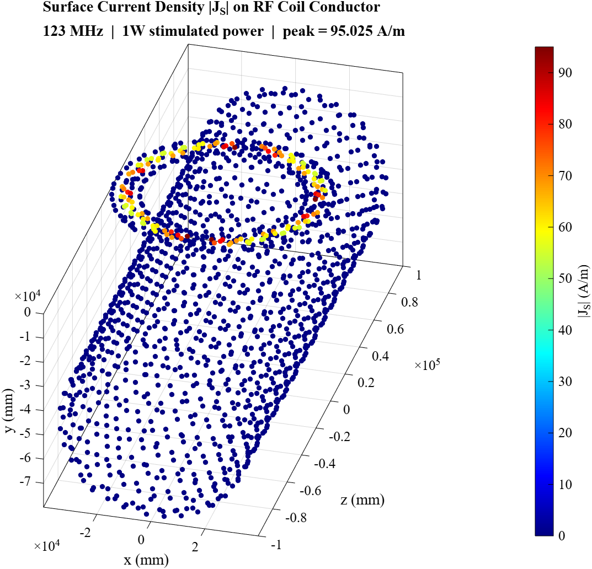
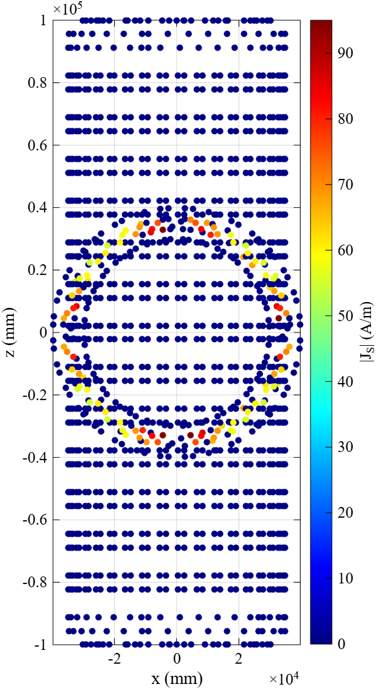

# MRI RF Surface Coil Simulation — 3T

Electromagnetic simulation of a circular surface loop coil for 3T MRI at 123 MHz using CST Studio Suite. The project covers coil geometry modelling, iterative tuning and matching via co-simulation, and post-processing of B1+, B1−, and SAR10g field distributions using MATLAB.

---

## Key Results

| Quantity | Value | Notes |
|---|---|---|
| Operating frequency | 123 MHz | 3T Larmor frequency |
| S11 minimum | -34.27 dB | Well below -30 dB threshold |
| Tuning capacitor Ct | 42.25 pF | Ports 1–4 |
| Matching capacitor Cm | 10.0 pF | Port 1 (series) |
| Reflected power | < 0.04% | Excellent matching |
| B1+ / B1− peak | ~12–13 µT | At coil plane, normalised to 1W |
| SAR10g maximum | 8.26 W/kg | Phantom surface beneath coil |
| Surface current peak | 95.025 A/m | Near capacitor gaps |

---

## Coil Specifications

| Parameter | Value |
|---|---|
| Type | Circular surface loop |
| Outer diameter | 75 mm |
| Inner diameter | 65 mm |
| Conductor material | PEC (Perfect Electric Conductor) |
| Conductor thickness | 35 µm |
| Conductor width | 5 mm |
| Substrate | FR-4, 1.5 mm thick (εr = 4.3, tan δ = 0.025) |
| Number of ports | 4 (equally spaced at 90°) |
| Coil-to-phantom gap | 10 mm |
| Coil orientation | Flat in XZ plane |

---

## Phantom Specifications

| Parameter | Value |
|---|---|
| Shape | Homogeneous cylinder |
| Diameter | 70 mm |
| Length | 200 mm |
| Material | Water liquid |
| Relative permittivity | εr = 78 |
| Electrical conductivity | σ = 1.59 S/m |
| Orientation | Along z-axis (bore direction) |

---

## Simulation Settings

| Parameter | Value |
|---|---|
| Software | CST Studio Suite (Time-domain solver) |
| Numerical method | FIT (Finite Integration Technique) |
| Frequency | 123 MHz |
| Solver accuracy | -40 dB |
| Normalisation | 1W stimulated power |
| Mesh — coil conductor | 2 mm max cell size |
| Mesh — FR-4 substrate | 4 cells across thickness |
| Mesh — phantom | 2 mm absolute cell size |

---

## Repository Structure

```
MRI-RF-Coil-Simulation-3T/
├── MATLAB/
│   ├── RF_Coil_Viewer.m          # Interactive 9-panel B1+/B1-/SAR viewer
│   └── Surface_Current_Viewer.m  # Surface current density visualisation
├── Results/
│   ├── Export_B1p_XY_z0.png      # B1+ XY plane at z=0
│   ├── Export_B1p_XZ_y0.png      # B1+ XZ plane at y=0
│   ├── Export_B1p_YZ_x0.png      # B1+ YZ plane at x=0
│   ├── Export_B1p_XZ_ym10.png    # B1+ XZ plane at y=-10mm
│   ├── Export_B1m_XY_z0.png      # B1- XY plane at z=0
│   ├── Export_B1m_XZ_y0.png      # B1- XZ plane at y=0
│   ├── Export_B1m_YZ_x0.png      # B1- YZ plane at x=0
│   ├── Export_B1m_XZ_ym10.png    # B1- XZ plane at y=-10mm
│   ├── Export_SAR_XY_z0.png      # SAR XY plane at z=0
│   ├── Export_SAR_XZ_ym46.png    # SAR XZ plane at y=-46mm
│   ├── Export_SAR_YZ_x0.png      # SAR YZ plane at x=0
│   ├── Export_JS_3D.png           # Surface current 3D scatter
│   └── Export_JS_XZ.png           # Surface current top-down XZ view
├── Protocol/
│   └── Protocol_Kuljit_Singh.pdf  # Full scientific protocol
└── README.md
```

---

## MATLAB Scripts

### RF_Coil_Viewer.m
Interactive 9-panel slice viewer for B1+, B1−, and SAR10g fields.
- Reads HDF5 exports from CST: `Test_3D_B1p.h5`, `Test_3D_B1m.h5`, `Test_3D_SAR.h5`
- Shows XY, XZ, YZ planes simultaneously for each field
- Three interactive sliders to control X, Y, Z slice positions
- Fixed colour scales: 0–10 µT for B1 fields, 0–8 W/kg for SAR
- Export button under each panel saves clean PNG

### Surface_Current_Viewer.m
Visualises surface current density on the RF coil conductor.
- Reads HDF5 export from CST: `Test_3D_JS.h5`
- Figure 1: 3D scatter plot of |JS| on the coil ring
- Figure 2: Top-down XZ view of surface current distribution
- Figure 3: |JS| vs circumferential angle showing current uniformity

---

## Field Map Results

### Transmit Field B1+

**XY plane (z = 0 mm)**


**YZ plane (x = 0 mm)**


---

### SAR10g Distribution

**XY plane (z = 0 mm)**


**XZ plane (y = -46 mm)**


---

### Surface Current Density

**3D scatter view**



**Top-down XZ view**


---

## Physics Summary

**B1+ and B1−** maps are nearly identical because this is a single linear loop coil. By the reciprocity principle, the receive sensitivity equals the transmit field at every point, so |B1−| = |B1+|. The field is strongest at the coil plane (y = 0) and decays rapidly with depth, giving an effective imaging depth of approximately 30–40 mm.

**SAR10g** is highest at the upper phantom surface directly beneath the coil, where the RF magnetic field is strongest and induces the largest currents in the conductive tissue (σ = 1.59 S/m). The XZ plane at y = −46 mm shows two parallel bright bands corresponding to the left and right outer walls of the cylindrical phantom visible in longitudinal cross-section.

**Surface current** peaks near the four capacitor gap positions (0°, 90°, 180°, 270°) where the lumped elements locally perturb the current path. The relatively uniform distribution between gaps confirms correct tuning.

---

## Software and Tools

| Tool | Purpose |
|---|---|
| CST Studio Suite | 3D EM simulation, co-simulation, post-processing |
| MATLAB | HDF5 data reading, field visualisation, export |
| LaTeX / Overleaf | Scientific protocol writeup |

---

## University

**Otto von Guericke University Magdeburg**  
Faculty of Electrical Engineering and Information Technology  
Research Campus STIMULATE  
Course: MR Systems Engineering  
Date: June 2026  

---

## Author

**Kuljit Singh**  
GitHub: [kuljit-medtech](https://github.com/kuljit-medtech)
